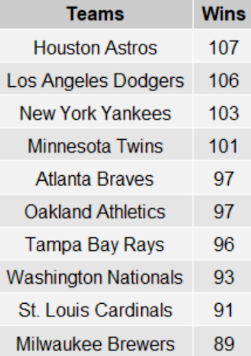
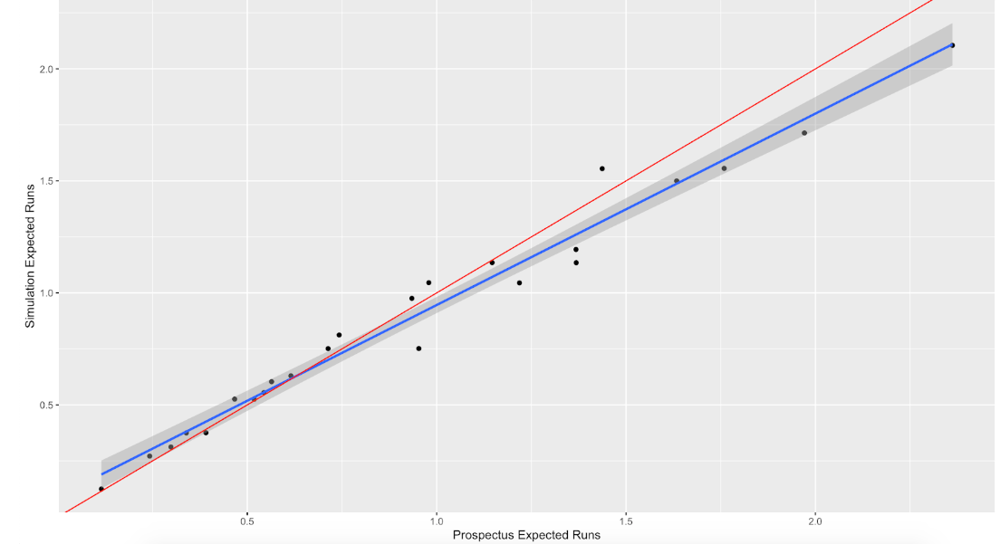
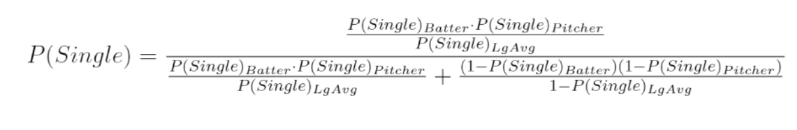
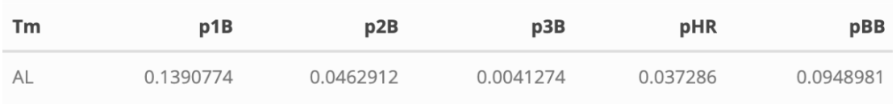
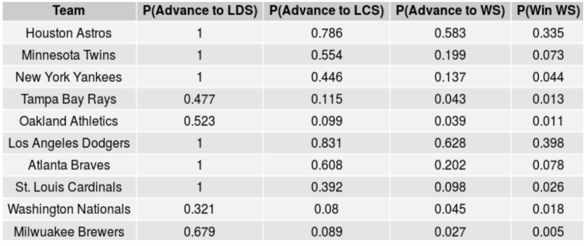
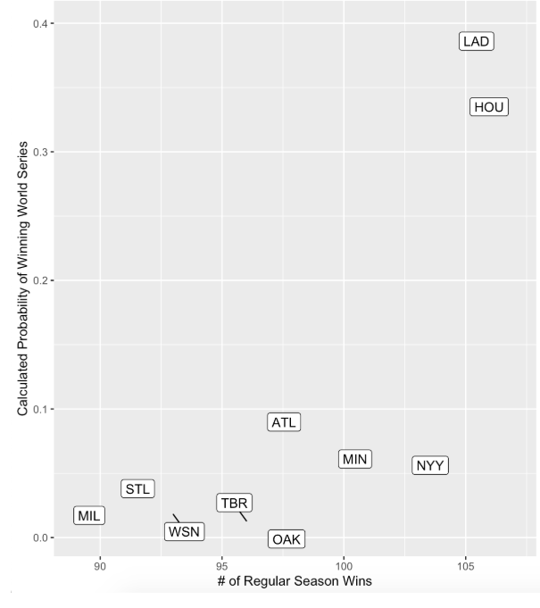
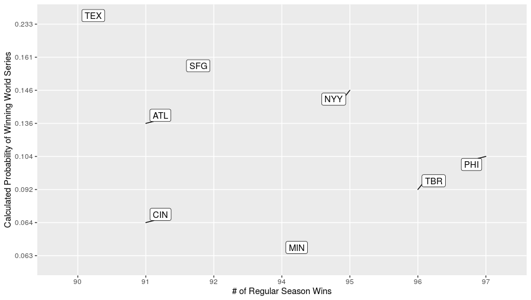

```{r setup, include=FALSE}
knitr::opts_chunk$set(echo = TRUE)
```

\center __Abstract__ \center  

\begin{flushleft}

In 2010, The San Francisco Giants defeated the Texas Rangers to claim the World Series. More recently, in October 2019, the Washington Nationals overcame the Houston Astros to win their first championship. In both instances, fans across the country were held in disbelief as teams deemed “underdogs” battled through the postseason to win World Series championships. Following the Giants’ victory in 2010, a study was conducted by Thomas Rudelius at Cornell University titled “Did The Best Team Win? Analysis of the 2010 Major League Baseball Postseason Using Monte Carlo Simulation.” This study used 2010 regular season statistics to conduct 2,000,000 simulations of each possible postseason matchup, and concluded that the Giants and the Rangers were indeed the teams from each league that could have most likely expected to advance to the World Series, despite their regular season performance. In replicating and applying similar methods from the 2010 study to the 2019 MLB Postseason, we found that the Los Angeles Dodgers and the Astros were most heavily favored to compete for a championship. The Nationals however, wound up emerging victorious, while only given a 1.8\% chance of winning the World Series. That indicated the magnitude of their upset championship run this past October, showing us once again how sports are so prone to shocking victories and stunning defeats.

\end{flushleft}

\pagebreak

\center __Motivation__ \center

\begin{flushleft}

As upperclassmen statistics students, each with an interest in using our degrees to break into the sports industry, we all agreed early on that we wanted to use this project to enhance our statistical computing knowledge in the context of a specific sports-related problem. We all have a love for baseball specifically and have always found the ways that sports networks and TV analysts try to predict sporting outcomes (Ex: ESPN’s Win Probability and 538.com) intriguing. In discovering and reading the original study, which used Monte Carlo to simulate and predict the 2010 MLB Postseason, we knew instantly that we had found the work that we wanted to replicate for this assignment. Our introduction, methodology, results and references follow below. 

\end{flushleft}

\center __Introduction__ \center

\begin{flushleft}

The Major League Baseball postseason is a four round, single-elimination tournament designed to narrow a pool of ten teams down to one champion. The ten teams that compete in the postseason earn berths by possessing one of the top five records in either the American League or National League, after a 162-game regular season. Thus, and understandably so, analysts and fans tend to use regular season record as a basis for predicting which teams will perform well or not in the postseason. Figure 1 below shows the number of regular season wins for each of the ten teams that competed in the 2019 MLB Postseason. 

\end{flushleft}

{width=200px}


\center Figure 1: Regular Season Wins \center

\begin{flushleft}

To an extent, this is a fair way to assess a team’s ability; if a team won 105 games, one would expect them to defeat a team with just 90 wins more often than not. But, perhaps more so than any other professional sport, baseball postseason play is inherently incredibly unpredictable. 

As noted in the original 2010 study, a 2006 Baseball Prospectus examination of postseason success found a mere .22 correlation (Silver \& Perry) between postseason success points and regular season winning percentage. There are many reasons why regular season success is not an accurate predictor of postseason success. 

The original study noted three factors: (1) run scoring in baseball is not linear in nature, (2) teams in the postseason rely heavily on four-men pitching rotations instead of the common five in the regular season, and (3) a team only needs to win three,(now four if a wild-card team) series to win a championship, meaning some teams may face teams they match up well against, and others may simply face a tougher opponent early on (Rudelius). A 2019 Forbes article mentioned several other factors that add to the difficulty found in predicting postseason baseball. For example, teams may enter the postseason on winning streaks or losing streaks, meaning that momentum, or lack thereof, can alter the outcome of a series. 

Furthermore, teams may have injuries or players that are tired, rested, or over-rested. Other factors include the home-field advantage that comes from fan support and players being familiar with their home ballpark, as well as payroll, which can play a large role in roster quality. (Schlossberg) Finally, according to Bleacher Report, only 10 of 30 teams (33\%) qualify for the MLB playoffs every season, which is the lowest percentage of any of the four major sports, indicating that the teams competing in the playoffs are usually very close in skill level, meaning that there is not typically an overwhelming favorite (Vozza). 

For all of these reasons, postseason baseball can be difficult to predict, especially with regression models. As such, despite the difficulties named above, it was our objective to use Monte Carlo methods to simulate the 2019 Major League Baseball postseason. Similar to the goals of the original study, it was our objective to answer the following two questions:

\end{flushleft}

\center
1. With what probability could each of the ten teams in the 2019 MLB Postseason expected to have won the World Series?
2. To what extent do our results compare to the actual results in October 2019?
\center

\center __Methodology__ \center

\begin{flushleft}

Our biggest challenge in this project was working to replicate, as closely as possible, the methods found in the 2010 study. What at first seemed clear in the original paper proved many times, in many different situations, to be unclear and incomplete. This was largely because Rudelius did not include any R code in his paper, so it took a fair bit of interpretation and inference to be able to move forward at various points. However, Rudelius did still give us a rough outline of his methodology in his paper, and it was within this framework that we worked to collect, clean and work with the data we needed to reach a point where we could run simulations. 

To begin, we had to gather all of the necessary data from BaseballReference.com. This included the pitching and batting data from all ten postseason teams, as well as some league wide data. This data required cleaning and manipulating to be useful. The main work that needed to be done was narrowing down the entire pitching staff of each team into the four primary starters and one, compilation reliever. The four starters formed the starting rotation that each team would use in the postseason and the bullpen was simplified into one reliever that entered each game in the 7th inning until it was over. (to simplify the simulations by not requiring coaching decisions to be included). This compilation reliever was the average of the team’s five most prolific relievers, again, to simplify the simulations. 

Work also had to be done to trim and clean each team’s batting data. Again, for the sake of simplifying simulations, it was assumed that each team used the same 9 man batting lineup in each game of each series. These lineups were created by cross-referencing the batter data with the MLB.com website that posted the lineups of each game this postseason. When all was said and done, these 9 batter lineups consisted of 8 fielders, as well as each team’s designated hitter for American League teams and World Series games played when the American League team was home, or a pitcher for National League teams and World Series games where the National League team was home. Rather than using the individual pitchers’ statistics for each team, which have a very small sample size, the overall average batting statistics of all pitchers in the 2019 regular season was used for each team. This means all pitchers were treated as equal hitters. 

Next, each batter and pitcher’s probabilities of either hitting or giving up a single, double, triple, home run or walk was required to be calculated. These values, along with the American League’s averages (due to complications with not having designated hitters in the National League), were used in the log5 calculations later to simulate each specific at-bat matchup between batter and pitcher. Once the data was fully cleaned, we could begin to work on simulating baseball plays.

We started simple, only simulating one inning at a time, using league average data and controlled for baserunner locations on the bases and number of outs. This helped us determine the accuracy of the simulation compared to real life data. An inning was ran by sampling one value with the possible outcomes being the batter is out, he hit a single, double, etc., each with the league average probability of occurrence (altered later to be the pitcher vs. batter matchup using the log5 method). Given the outcome, the base runners, outs and runs scored would update to the most common scenario. For example, if a runner is on second and the batter hits a single, it is assumed the runner will score. This of course is not always the case, but those are outlier examples and the simulation would become too convoluted if all possible baseball scenarios were accounted for. 

Once we were able to make the inning simulation run until three outs were recorded, we were able to test all 24 possible base-out scenarios (no one on base with no outs, runner on first with one out, bases loaded with two outs, etc.) and gather the expected runs from each situation. Each scenario was simulated 10,000,000 times. Then, the mean runs scored from the simulation were compared to the expected runs from the 2019 MLB regular season from Baseball Prospectus (“Custom Statistic Report: Run Expectations”). The results weren’t perfect, but they gave reassurance about the model simulator being able to run baseball innings to completion and being able to track runs, which is obviously crucial in this project. If the simulator were perfect, the simulation vs prospectus linear model would have a slope of one and the intercept would be zero. In reality, the slope was 0.854 and the intercept was 0.091. This isn’t terrible, as the results are actually pretty close to ideal when the expected runs are between 0 and 1.5, but the results start tailing off a little bit between 1.5 and 2.5, as seen below:

\end{flushleft}


\center Figure 2: Plot of Simulation Expected Runs vs. Prospectus Expected Runs \center

\begin{flushleft}
We already knew the simulation wouldn’t be perfect, as baseball is unpredictable and there are many different situations and plays that would be very difficult to model, but knowing that the results were in the ballpark of where they should be was reassuring enough to continue on with the project. The obvious step following the completion of the inning simulator was to scale up and build a game simulator. 

The first component needed to run a game was to establish the teams playing, which pitcher from each team is starting and building the pitching vs batting probabilities needed to run the plays. The log5 method of determining specific probabilities of batting plays is as follows:

\end{flushleft}



\begin{flushleft}

In the above formula, $\sf{P(Single)_{Batter}}$ is the probability that a specific batter singles in any plate appearance, $\sf{P(Single)_{Pitcher}}$ is the probability that a specific pitcher allows a single in any plate appearance and $\sf{P(Single)_{LgAvg}}$ is the American League league-wide probability of a single occurring. The probability of a double, triple, home run or walk was calculated in the same way. 

As a specific example, consider Cody Bellinger of the Los Angeles Dodgers facing Stephen Strasburg of the Washington Nationals. The probabilities of Cody Bellinger achieving any of the five events are below: 

\end{flushleft}


\begin{flushleft}

Similarly, the probabilities of Stephen Strasburg allowing any of the five events are as follows: 

\end{flushleft}


\begin{flushleft}

So, if we consider the league average probabilities: 

\end{flushleft}



\begin{flushleft}

And put all three sets of probabilities into the log5 method,, the following probabilities describe the chances of a single, double, triple, home run and walk occurring when Cody Bellinger faces Stephen Strasburg:

\end{flushleft}


\begin{flushleft}

Now having a way to obtain all of the needed probabilities we could fully simulate a game. Each inning was started with no runners on base and with zero outs, as usual, and ran until three outs were recorded. This stayed the same until the seventh inning, at which the starter was replaced with the reliever to play out the final three innings. To easily roll innings into the next, without mixing up teams and over-complicating the simulation, the game was essentially ran twice. First, the “away” team would bat for all nine innings and their runs were recorded, then the “home” team played nine innings on offense with their total runs recorded as well. In case that the game ended in a tie, rather than complicating the simulation with extra innings or splitting the odds of winning to 50/50, a Baseball Reference blog found that home teams win games that go beyond nine innings 53.1\% of the time. (“Home Team Record in Extra Innings.”) Therefore, if the game was tied after nine innings, one sample was taken with the home team given a 53.1\% chance of winning. Once the game was complete, the scores and the winner were reported. 

After we reached a point where full games could be successfully simulated, we could scale all the way up to simulating series.  All possible series, given the actual 2019 MLB postseason seeding, were simulated 100,000 times. This means that the two wild card games, six possible Divisional Round matchups, 12 possible Championship Round matchups and 25 possible World Series matchups were simulated and each team’s probability of winning a series was naturally calculated by dividing the total number of simulated series won by 100,000.

\end{flushleft}

\pagebreak

\center __Results__ \center

\begin{flushleft}

After running the 100,000 simulations of every possible matchup, we were left with the estimated probabilities that Team A would beat Team B for each series. For example, after simulating the AL Wild Card Game between the Oakland Athletics and Tampa Bay Rays, our model estimated that Oakland would win 52.3\% of the time and Tampa Bay would win the remaining 47.7\%. However, our goal was not just to determine the probabilities of each team beating each team that they played, but their overall probabilities of advancing to each round of the postseason, culminating in each team’s probability of winning the World Series. 

As such, the probability of each team advancing to a particular round of the postseason was calculated as the probability of that team making it to the previous round, multiplied by the sum of the probabilities that that team would beat each possible opponent in the previous round, weighted by the odds of them facing that opponent. For example, the probability of the Houston Astros advancing to the World Series was calculated as:

\end{flushleft}

\center 
P(HOU_Adv_WS) =  {P(HOU_Adv_ALCS) * [(P(HOU_Beat_NYY)* P(NYY_Adv_ALCS))  +   (P(HOU_Beat_MIN)*P(MIN_Adv_ALCS))]}
\center

\begin{flushleft}

It is through this method that we calculated the probabilities of each team advancing to the League Division Series (LDS), League Championship Series (LCS) and the World Series (WS), as well as each team winning the World Series. Those results are summarized in Figure 3 below.

\end{flushleft}

{width=425px}

\center Figure 3: Probabilities of Advancing to LDS,LCS,WS,Winning WS
\center

\begin{flushleft}

Seeing that the results in the table above are sorted by league and by odds of winning the World Series, we note that the Houston Astros and Los Angeles Dodgers were heavily favored by our model; both were given over a 50\% chance of advancing to the World Series and our simulation tells us that one of those two teams could have expected to win the World Series over 7 times out of 10 (33.5 + 39.8 = 73.3\%). 

It obviously follows that any other team winning, or even advancing to the World Series would be a surprise according to our simulations. None of the 8 other teams outside of the Dodgers or Astros were even given a 10\% chance of winning the World Series, and the four wild card teams (Nationals, Rays, Athletics, Brewers) were all heavy underdogs, each with individual probabilities of less than 2\%. However, it is of note that the Nationals were given the greatest odds of winning the World Series among the wild card teams at 1.8\%.

In real life, it was the Washington Nationals who defeated the Houston Astros 4 games to 3 in the World Series. So, as stated above, our simulation was half correct in predicting an Astros-Dodgers World Series as the most likely matchup. The Astros and Dodgers were far and away the best two regular season teams in the postseason, and this was a popular pick among analysts as well, as 6 of 10 MLB.com analysts picked the same World Series matchup in their pre-postseason predictions (“Who Will Win? Experts Weigh In”). However, the more concerning trend in our simulation results is the seemingly high correlation between regular season wins and probability of winning the World Series, especially compared to the original study. Figures 4 and 5 below show the relationships more clearly. 

\end{flushleft}

{width=430px}

\center Figure 4: Probability of Winning World Series vs. Regular Season Wins (Our Study)
\center

{width=550px}

\center Figure 5: Probability of Winning World Series vs. Regular Season Wins (Original Study)
\center

\begin{flushleft}

Whereas the original study was much more balanced in its results, our simulation clearly contained heavy bias towards teams with more regular season wins. There are several reasons why this might have been the case:

\end{flushleft}

\center
1. The simulations were conducted for different years with different teams, so it may be unreasonable to expect similar results anyway.
2. We were only able to conduct 100,000 simulations for each series, as opposed to the 2,000,000 used in the original study. It is likely that running 2,000,000 simulations would lead to more precise results than 100,000. 
3. The difference between the team with the most regular season wins and fewest regular season wins in 2019 was 18 wins, and the same difference in 2010 was just 7 wins. This could indicate more statistical inequality between the playoff competitors in 2019 compared to 2010, which would explain why some teams were more heavily favored in our study.
\center

\begin{flushleft}

In more general terms, there are many other sources of possible error that may have affected the accuracy of our simulations. These include the failure to include events such as sacrifice flies, sacrifice bunts, and double plays, all of which influence scoring, discrepancies between baserunning in the simulation and baserunning in real life (Ex: runners not always scoring from 2nd on a single), the effect that momentum and home field advantage has in playoff baseball, the failure to adjust to differences in ballpark dimensions, which influence run-scoring, the failure to account for defense and fielding in the model, and any form of coaching strategy such as decisions to use pinch-hitters or changing pitchers in-game. These, and other potential sources of error, may have small individual effects, but could contribute to some inaccuracy in our simulations. 

	In further study, it would be beneficial to test this model both with other postseason years (ex: 2011-2018), and with more simulations of each series. These would allow us to test the accuracy of our model beyond one set of simulations. It would also be intriguing, though difficult, to figure out how to adjust our model to include more complicated events such as sacrifice flies, and adjust for external factors such as ballpark dimensions. 

	This project enabled us, as enthusiastic sports fans, to examine a specific sports-related problem with the knowledge we’ve acquired this past semester. It was a unique experience to attempt to replicate a published study as accurately as possible, and while there were several ways in which we could have fallen short of the significance and accuracy of the original study, we ended up with results that were plausible and believable, which in the timeframe we had, was the most important outcome to us. We do hope to refine and work with this project in the future to continue to grow our own understanding of Monte Carlo and improve our ability to simulate baseball accurately.

\end{flushleft}

\pagebreak

\center 
__References__ 
\center  

- Schlossberg, Dan. "Picking Baseball's Postseason Champs Is Tough If Not Impossible." Forbes.com, 1 Oct.2019 https://www.forbes.com/sites/danschlossberg/2019/10/01/picking-baseballs-postseason-champs
-is-tough-if-not-impossible/#4b31ac0842d7

- Vozza, Lou. “Which Sport Has the Most Exclusive Playoff System?” Bleacher Report, 27 Jan. 2009, https://bleacherreport.com/articles/116150-which-sport-has-the-most-exclusive-playoff-system.

- Silver, Nate and Dayn Perry. “Why Doesn’t Billy Beane’s Shit Work in the
Playoffs?”. Baseball Between the Numbers. New York: Basic Books, 2006

- Rudelius, Thomas W. “Did the Best Team Win? Analysis of the 2010 Major League Baseball Postseason Using Monte Carlo Simulation.” Journal of Quantitative Analysis in Sports, 2012, https://pdfs.semanticscholar.org/3677/6ffa48f19d2e6d93641f6fe53b5ba15d9c98.pdf.

- “Custom Statistic Report: Run Expectations.” Baseball Prospectus, 2019, https://legacy.baseballprospectus.com/sortable/index.php?cid=1918829.

- “Home Team Record in Extra Innings.” Baseball Reference, 6 Aug. 2007, https://www.baseball-reference.com/blog/archives/155.html.

- “Who Will Win? Experts Weigh In.” MLB.com, 30 Sept. 2019, mlb.com/news/mlb-com-experts-make-2019-postseason-predictions.


